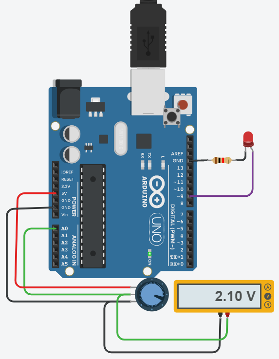
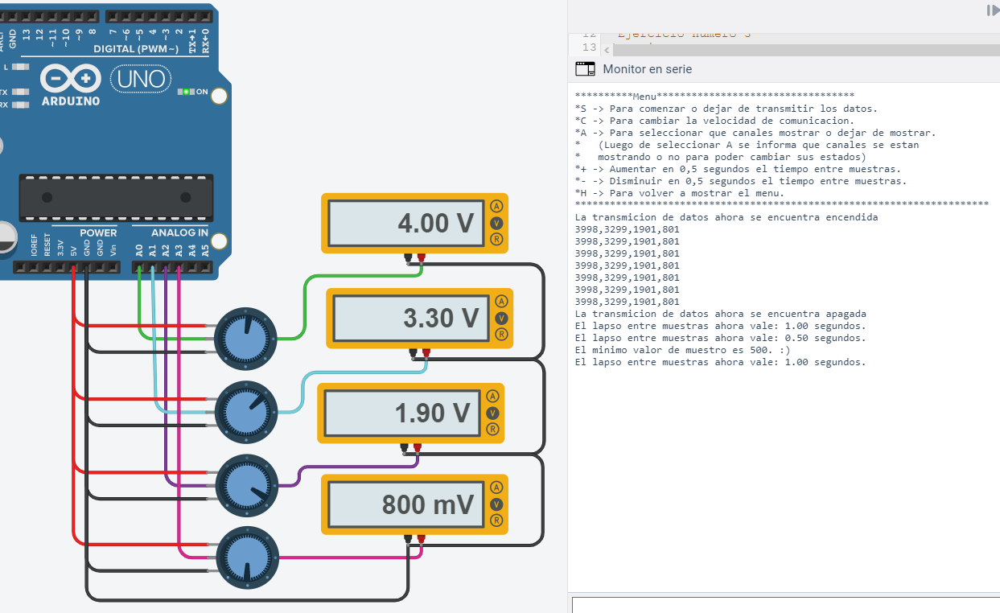

<h1 align="center">Hola 👋 soy Lorena Perugini</h1>

# Evaluación electrónica módulo 3.

 En este repositorio se encuentran los archivos correspondientes a la evaluación del tercer módulo de la materia de electrónica general. La cuál estoy cursando hasta el 2022 por medio del Sistema dual

 Las consignas de cada ejercicio se encuentran dentro de los archivos .ino en la carpeta correspondiente. Además están en la sección de código de todos los ejercicios simulados

## Ejercicio 1
<a href="Perugini-Ej1/Perugini-Ej1.ino">El código del ejercicio se encuentra aquí</a>
**[Este ejercicio se puede simular aquí](https://www.tinkercad.com/things/baNzKjucOXK)**

  Dejo una imágen de referencia. 

   

## Ejercicio 2
<a href="Perugini-Ej2/Perugini-Ej2.ino">El código del ejercicio se encuentra aquí</a>
**[Este ejercicio se puede simular aquí](https://www.tinkercad.com/things/b2sml6DmeOv)**

  Dejo una imágen de referencia. 

   

## Ejercicio 3
<a href="Perugini-Ej3/Perugini-Ej3.ino">El código del ejercicio se encuentra aquí</a>
**[Este ejercicio se puede simular aquí](https://www.tinkercad.com/things/0RPWJGyBJm9)**

  Dejo una imágen de referencia. 

   

### Anexo: Situación de las comas

Introducción

Este anexo es la explicación de la lógica detrás de la elección de las
condiciones dentro de los condicionales de las líneas 312, 318 y 324 dentro de
la función “muestreo” del tercer ejercicio de la evaluación correspondiente al
tercer módulo de la materia.

Realizo este anexo porque no me gusta que queden cosas que parecen
sacadas de un sombrero en mis evaluaciones, menos en esta materia, mucho
menos con un lenguaje que disfruto tanto como Arduino. Además, la verdad
que, la explicación me pareció muy interesante ya que conecta temas del primer
módulo. Me pareció sumamente divertido realizar esta lógica. Por todos esos
motivos me pareció coherente realizar este anexo.

 

<a href="Anexo_Comas_Perugini_Evaluación_Modulo_3.pdf"> Aquí se encuentra el anexo completo.</a>

## Contacto ✉️

* **[¡Envíame un email!](mailto:lorenaperuginikrause@gmail.com)**
